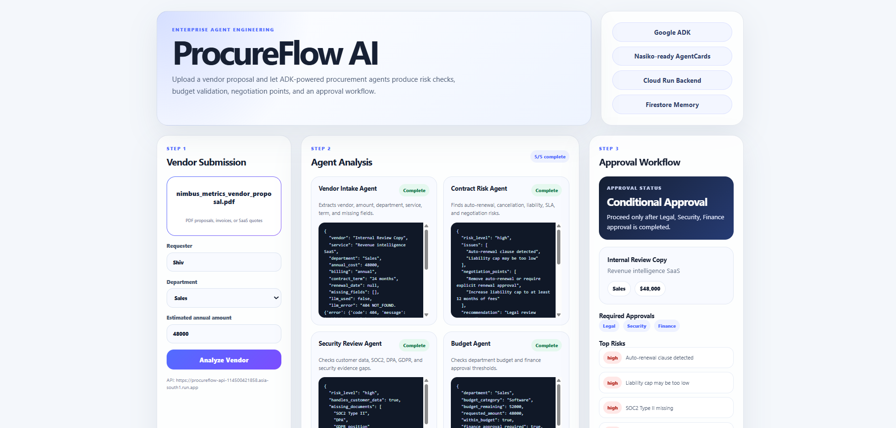

# ProcureFlow AI (download live demo video from repo)

## 🚀 Live Demo: [https://bwa-frontend-one.vercel.app](https://bwa-frontend-one.vercel.app/)



ProcureFlow AI is an enterprise procurement and vendor onboarding agent system that turns a vendor proposal PDF into a risk-aware approval workflow.

Employees upload a vendor proposal, and the system extracts proposal text, sends it through Gemini-powered procurement agents, checks budget policy, flags legal/security risks, and returns a final approval decision for finance, legal, security, and procurement teams.

## What It Does

- Uploads and reads vendor proposal PDFs.
- Extracts vendor, service, department, contract value, billing, and contract term.
- Flags risky contract terms like auto-renewal, long cancellation windows, and weak liability caps.
- Checks security/compliance evidence such as SOC2, DPA, GDPR, and customer data handling.
- Checks department budget and finance approval thresholds.
- Generates a final approval workflow with required reviewers and next steps.

## Agent Workflow

```text
Vendor PDF
  → PDF text extraction
  → Vendor Intake Agent
  → Contract Risk Agent
  → Security Review Agent
  → Budget Agent
  → Approval Orchestrator Agent
  → Final approval workflow
```

## Tech Stack

- **Frontend:** Vite + React, Vercel-ready
- **Backend API:** FastAPI on Google Cloud Run
- **Agents:** FastAPI agent service with Gemini / Vertex AI calls
- **Memory:** Firestore case records
- **Deployment:** Cloud Run + Artifact Registry
- **Orchestration:** Nasiko-ready AgentCards for agent registration/routing

## Live Backend Services

```text
API:
https://procureflow-api-114500421858.asia-south1.run.app

Agents:
https://procureflow-agents-114500421858.asia-south1.run.app
```

## Project Structure

```text
.
├── bwa-backend
│   ├── procureflow-api
│   │   └── app
│   ├── procureflow-agents
│   │   ├── app
│   │   └── agentcards
│   ├── BACKEND_PLAN.md
│   ├── DEPLOYMENT.md
│   └── GOOGLE_CLOUD_SETUP.md
├── bwa-frontend
│   └── src
├── image.png
└── README.md
```

## Run Frontend Locally

```bash
cd bwa-frontend
npm install
npm run dev
```

The frontend uses:

```text
VITE_PROCUREFLOW_API_URL=https://procureflow-api-114500421858.asia-south1.run.app
```

## Test Backend PDF Upload

```powershell
curl.exe -X POST "https://procureflow-api-114500421858.asia-south1.run.app/analyses" `
  -F "file=@C:\Users\shiv\Downloads\acme_analytics_vendor_proposal.pdf;type=application/pdf" `
  -F "requester=Shiv" `
  -F "department=Sales" `
  -F "estimated_amount=48000"
```

## Demo Output

The app returns:

- Vendor details
- Agent-by-agent analysis
- Contract risks
- Security/compliance gaps
- Budget result
- Required approvals
- Final approval workflow

Example decision:

```text
Status: Conditional Approval
Required Approvals: Legal, Security, Finance
Summary: Proceed only after Legal, Security, Finance approval is completed.
```

## Deployment

Backend deployment commands are documented in:

```text
bwa-backend/DEPLOYMENT.md
```

Google Cloud setup notes are documented in:

```text
bwa-backend/GOOGLE_CLOUD_SETUP.md
```

Frontend deployment:

1. Import `bwa-frontend` into Vercel.
2. Use Vite defaults.
3. Set environment variable:

```text
VITE_PROCUREFLOW_API_URL=https://procureflow-api-114500421858.asia-south1.run.app
```

## Hackathon Track Fit

ProcureFlow AI fits **Track B: Enterprise Agent Engineering** by demonstrating:

- Multi-service orchestration
- Google Cloud Run deployment
- Gemini / Vertex AI agent reasoning
- Firestore-backed case memory
- Nasiko-compatible agent registry metadata
- Enterprise workflow automation
